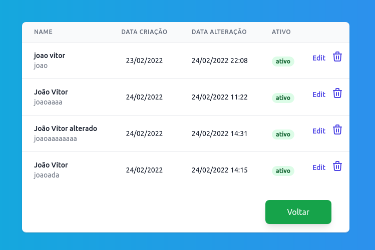

## Sistema de autenticação

Pequeno sistema pessoal de autenticação para aprimorar meus conhecimentos em reactjs, nextjs, typescript e nodejs, desenvolvido com banco de dados postgre.

**Bibliotecas frontend:** axios, js-cookie, typescript, tailwindcss.

**Bibliotecas backend:** bcrypt-nodejs, consign, cors, express, jwt-simple, pg, sequelize

